# Vidferry

Vidferry 是一个本地优先的视频二次创作工作流项目，目标是把“发现视频、下载视频、字幕翻译、视频处理、素材管理、发布准备”串成一条可持续完善的流水线。

当前发布的是 **1.0.0 首版开发版本**。这一版已经完成了核心工作流的第一轮打通，重点覆盖 YouTube 视频线索查询、`yt-dlp` 下载、`faster-whisper` 转写、中文字幕翻译、FFmpeg 字幕/信息烧录、处理后素材入库、LLM 文案生成、发布中心素材选择等能力。

项目仍在持续开发中，可能仍存在未覆盖的 Bug、平台适配问题或交互细节不完善。欢迎通过 [Issues](https://github.com/Thendras-1024/Vidferry/issues) 反馈问题、建议和复现步骤。

## 项目状态

- 当前版本：`1.0.0`
- 当前定位：本地开发和个人工作流验证工具
- 当前不做：生产部署、多用户系统、用户权限管理、云端队列、正式 SaaS 化
- 当前重点：完成第一版视频处理与剪辑增强链路，验证从视频线索到处理后素材的闭环
- 已知情况：项目还没有完全开发完成，部分平台登录、发布、视频兼容性和异常恢复仍可能有问题，敬请谅解

## 项目界面预览（左右滑动查看更多）

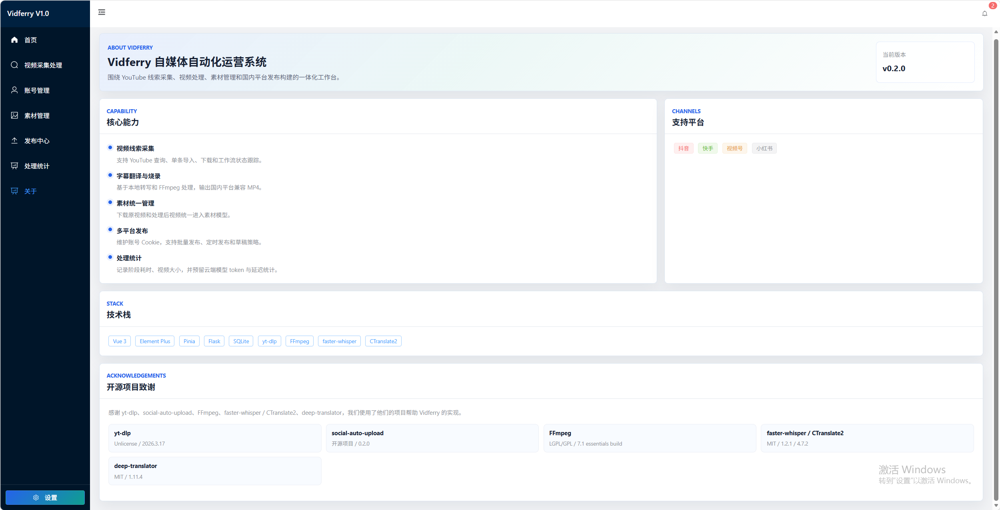 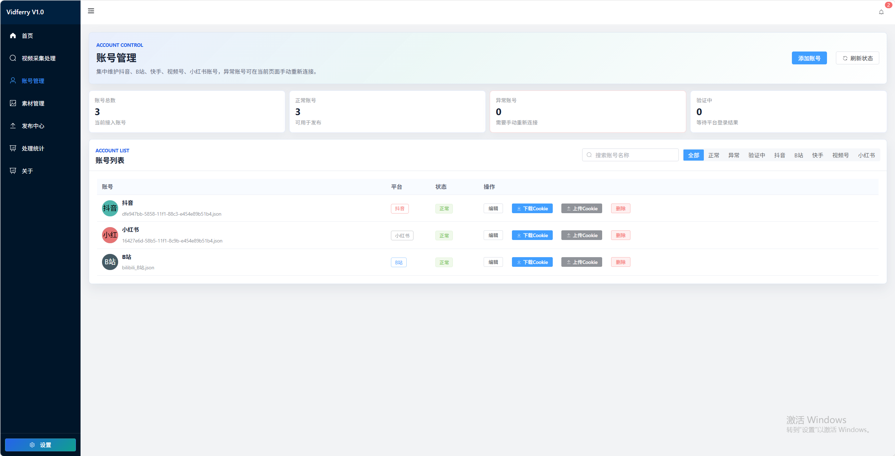 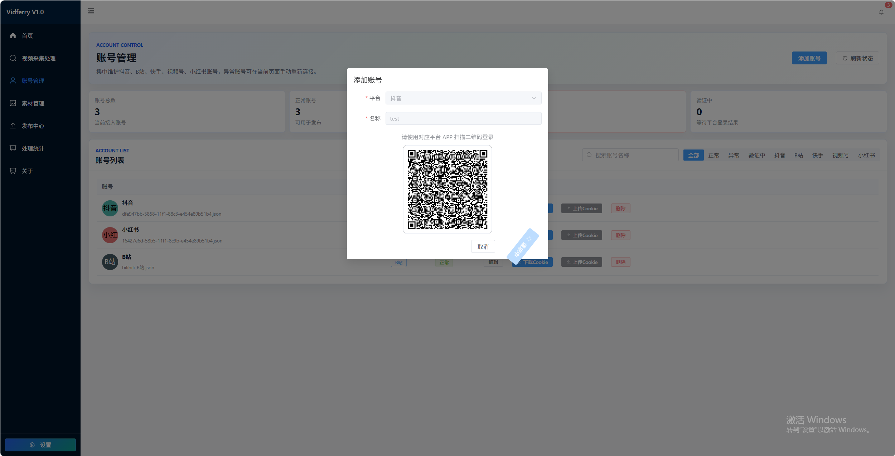 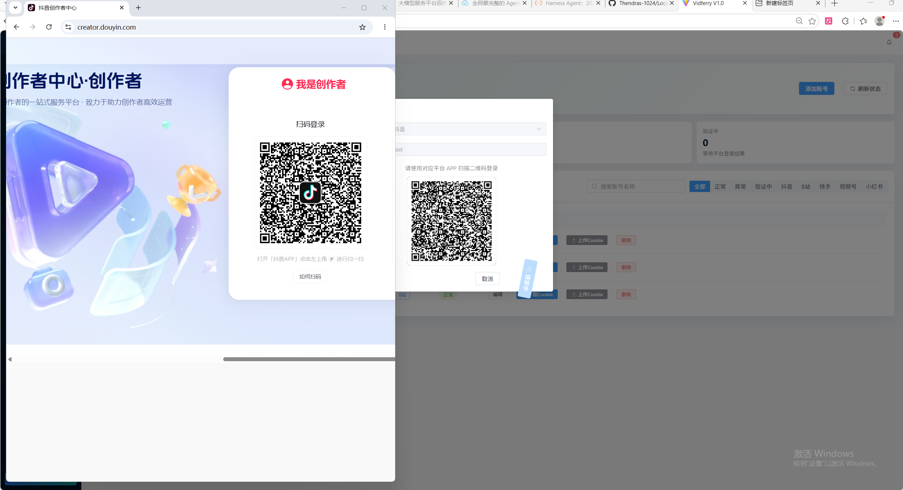 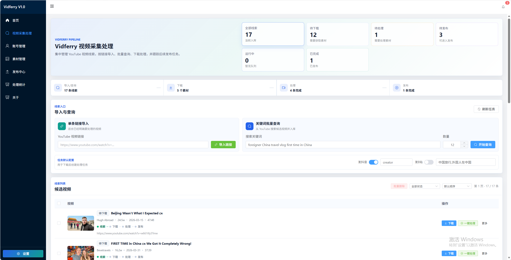 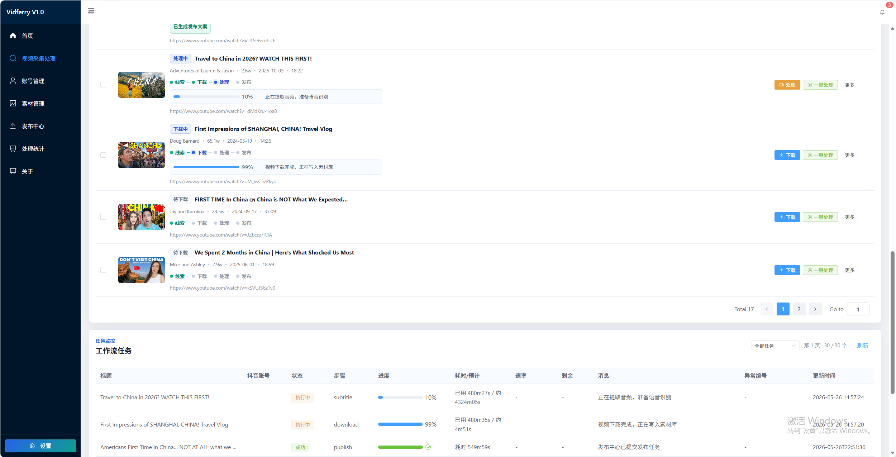 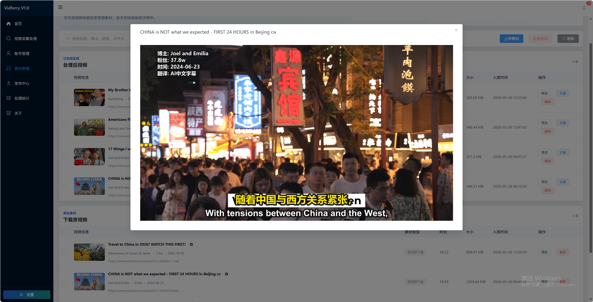 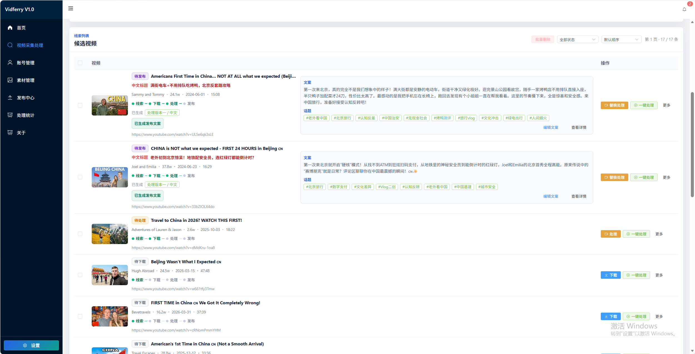 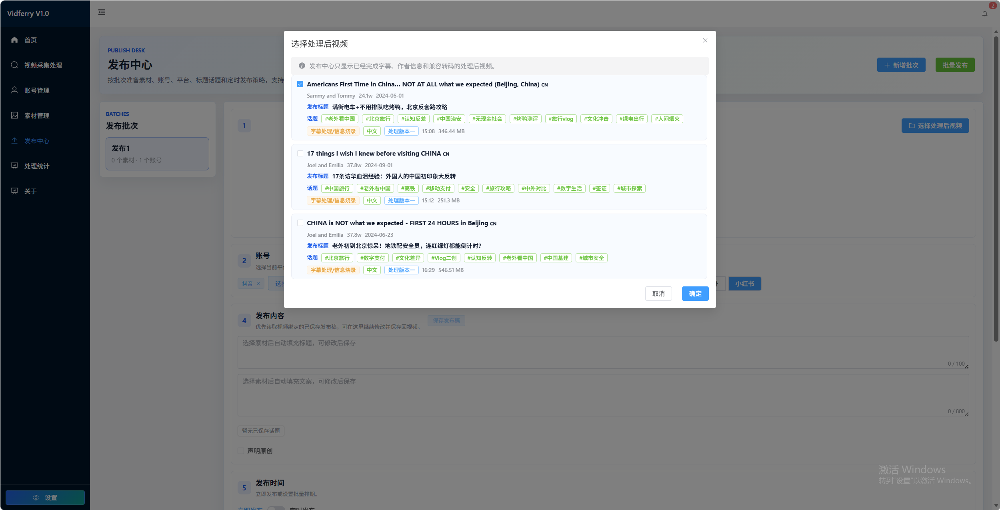 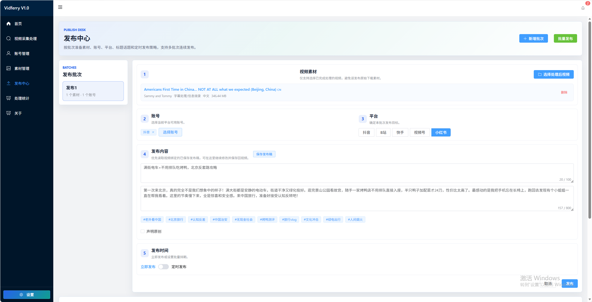 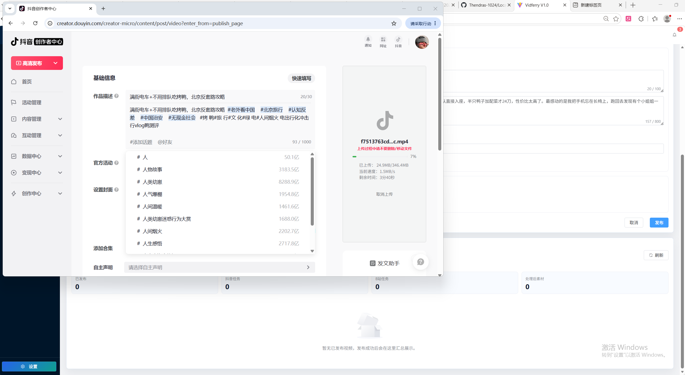 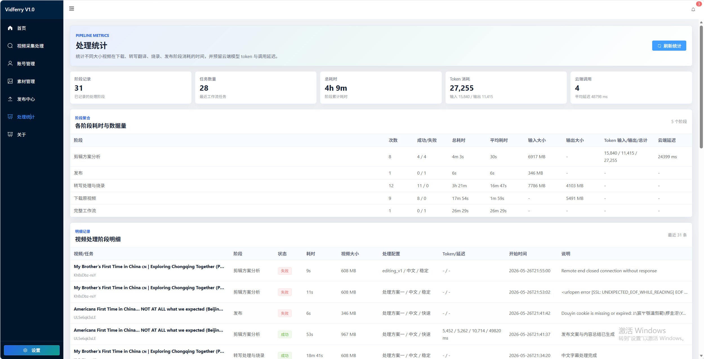

## 已实现能力

### 视频线索查询

- 支持通过关键词批量查询 YouTube 视频线索。
- 支持手动导入 YouTube 视频链接。
- 保存视频标题、频道、粉丝数、发布时间、时长、缩略图和原始链接。
- 支持线索状态展示、状态筛选、失败任务提示和线索删除保护。

### 视频下载

- 基于 `yt-dlp` 下载 YouTube 视频。
- 下载完成后写入统一素材模型。
- 下载状态由任务执行结果自动更新。
- 已下载视频会进入素材管理中的“下载原视频”模块。

### 字幕翻译与视频处理

- 使用 `faster-whisper` 对视频音频进行转写。
- 生成中文字幕并构建 ASS 字幕。
- 使用 FFmpeg 进行字幕烧录、左上角原作者信息展示、兼容国内平台的 MP4 输出。
- 支持处理后视频入库。
- 支持处理版本维度，避免同一视频不同处理方案互相覆盖。

### 第一版剪辑增强

- 已完成第一版处理链路。
- 处理版本二已开始接入高光片段分析和开头片段处理能力。
- 当前剪辑增强仍在完善中，效果、参数和异常处理后续会继续迭代。

### LLM 内容分析

- 支持基于视频转写文本和视频元数据生成：
  - 视频总结
  - 标题候选
  - 发布正文文案
  - 话题标签
  - 高光片段
- LLM 生成内容会作为原始分析结果持久化。
- 用户实际发布使用的标题、文案、话题会单独保存为发布稿，不覆盖 LLM 原始结果。
- 发布文案生成失败时，可以只重新生成文案，不必重新下载或重新处理视频。

### 素材管理

- 下载原视频和处理后视频分模块展示。
- 处理后素材展示处理版本、字幕语言、来源视频、基础信息和隐藏技术字段。
- 发布中心只选择处理后视频，避免误发布原始下载素材。

### 发布中心

- 支持从素材库选择处理后视频。
- 自动带入已保存的发布稿标题、文案和话题。
- 发布中心的发布内容默认只读，修改需回到视频采集处理页保存发布稿。
- 当前发布链路仍以本地验证为主，不保证所有平台规则变化都能即时适配。

### 账号与任务

- 保留多平台账号管理和扫码登录能力。
- 支持工作流任务列表、状态、进度、失败信息和处理统计。
- 当前账号管理不是完整用户系统，也没有权限模型。

## 暂未完成或不在当前范围

- 不提供生产部署方案。
- 不提供多用户登录、角色权限、租户隔离。
- 不保证所有国内平台发布链路长期稳定，平台页面和规则变化可能导致失效。
- 不保证所有 YouTube 视频都可下载、转写或处理。
- 自动剪辑、封面、BGM、信息条、对象存储、云端任务队列仍在后续规划中。

## 工作流概览

```text
视频线索查询 / 手动导入
  -> 保存视频元数据
  -> yt-dlp 下载原视频
  -> 原视频入库
  -> faster-whisper 转写
  -> 中文字幕翻译
  -> FFmpeg 烧录字幕和作者信息
  -> 输出国内平台兼容 MP4
  -> 处理后素材入库
  -> LLM 生成标题 / 文案 / 话题 / 高光片段
  -> 发布中心选择处理后素材
```

## 本地开发

建议使用两个终端分别启动后端和前端。

### 后端启动

推荐使用 `uv`：

```bash
uv sync --extra web
.\.venv\Scripts\python.exe run.py
```

也可以使用普通虚拟环境：

```bash
python -m venv .venv
.\.venv\Scripts\activate
pip install -r requirements.txt
.\.venv\Scripts\python.exe run.py
```

默认后端地址：

```text
http://127.0.0.1:5409
```

### 前端启动

```bash
cd sau_frontend
npm install
npm run dev
```

默认前端地址：

```text
http://127.0.0.1:5173
```

### 推荐启动顺序

1. 先启动后端。
2. 再启动前端。
3. 修改后端代码后通常需要重启后端。
4. 修改前端代码后由 Vite 热更新，必要时重新执行 `npm run dev`。

## 环境变量

复制 `.env.example` 为 `.env`，并根据本地环境调整：

```env
YOUTUBE_DOWNLOAD_DIR=./videos/youtube
YOUTUBE_PROCESSED_DIR=./videos/processed
YOUTUBE_TRANSCRIPT_DIR=./videos/transcripts
```

本地视频、Cookie、数据库、`.env` 不应提交到 Git。

## LLM / DashScope 配置

内容分析使用 OpenAI 兼容格式的 Chat Completions 接口。可以使用 DashScope，只需在 `.env` 中配置：

```env
LLM_BASE_URL=https://dashscope.aliyuncs.com/compatible-mode/v1
LLM_API_KEY=sk-请替换为你的DashScopeKey
LLM_MODEL=qwen-plus
LLM_TIMEOUT=90
LLM_MAX_TRANSCRIPT_CHARS=28000
```

安全建议：

- 不要把 API Key 写入前端代码、提交记录、截图或公开文档。
- `.env` 必须只保留在本机。
- 如果怀疑 Key 泄露，请立即到平台控制台禁用或轮换。
- 修改 LLM 配置后需要重启后端。

## FFmpeg 与本地依赖

视频处理依赖 FFmpeg。请确保本机可以在命令行执行：

```bash
ffmpeg -version
```

如果 FFmpeg 未安装或不在 PATH 中，视频下载后的合并、字幕烧录和转码会失败。

## 目录说明

```text
app/                 新增后端模块化目录
sau_backend.py       当前主要后端入口和业务逻辑
sau_frontend/        Vue 3 + Vite 前端
videos/              本地下载、转写、处理输出目录
videoFile/           素材库文件目录
db/                  本地 SQLite 数据库
cookiesFile/         平台账号 Cookie 文件
```

后端仍在拆分重构中，部分业务逻辑还集中在 `sau_backend.py`。后续会继续按模块拆分，降低耦合。

## 注意事项

- 请确保下载、处理和发布的视频符合内容版权和平台规则。
- 本项目不鼓励未经授权搬运内容。
- 国内平台发布规则变化较快，扫码登录和发布能力可能需要持续适配。
- 当前版本更适合本地开发、测试和个人流程验证，不建议直接作为生产系统使用。

## 技术栈

- 后端：Python、Flask、SQLite
- 前端：Vue 3、Vite、Element Plus、Pinia
- 下载：yt-dlp
- 转写：faster-whisper / CTranslate2
- 翻译：deep-translator
- 视频处理：FFmpeg
- 发布：基于 social-auto-upload / uploader 能力扩展

## 致谢

感谢以下开源项目对 Vidferry 的帮助：

- yt-dlp
- social-auto-upload
- FFmpeg
- faster-whisper / CTranslate2
- deep-translator
- biliup

## License

MIT License
