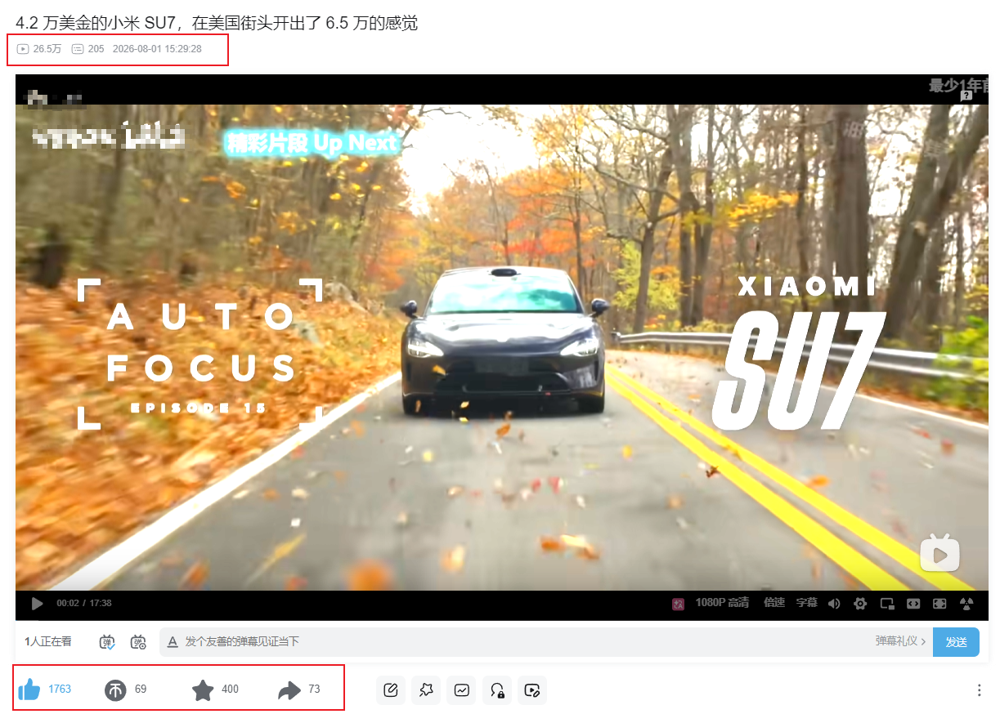
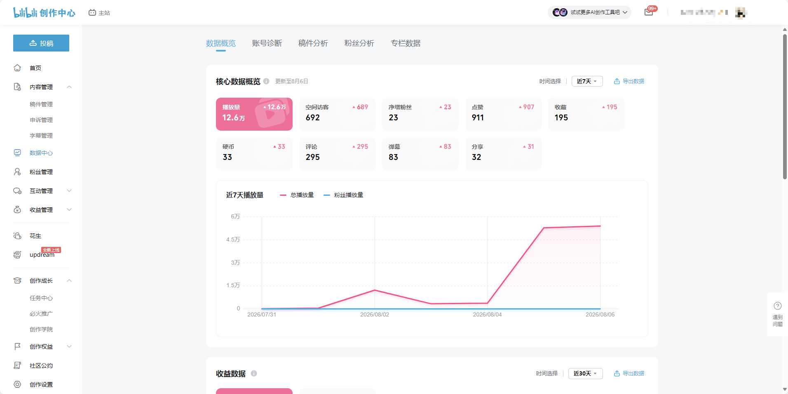
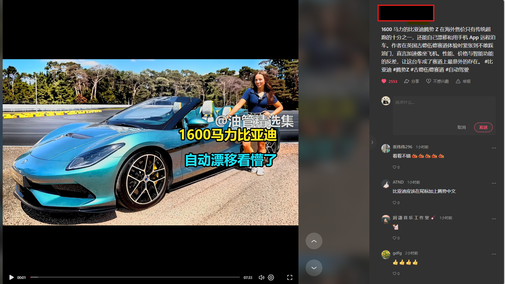
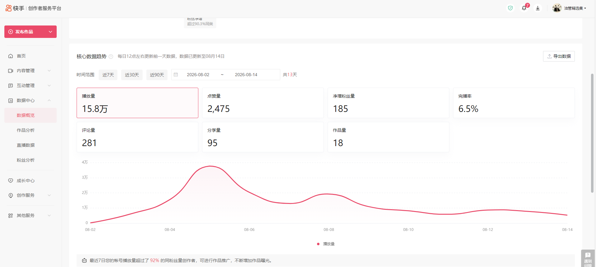

# Vidferry

Vidferry 是本地优先的视频采集、处理、素材管理与多平台发布工具。它将 YouTube 线索检索、下载、字幕处理、处理版本二剪辑增强、发布文案和账号发布串成一个可追踪的工作流。

项目面向本机或受控内网部署。YouTube、平台登录和自动发布都依赖本机网络、浏览器及第三方平台规则，不适合作为直接暴露公网的多租户服务。

## 已发布账号运营效果

<table>
  <tr>
    <td width="50%"><a href="img/effort/bilibili_data1.png"></a></td>
    <td width="50%"><a href="img/effort/bilibili_data2.png"></a></td>
  </tr>
  <tr>
    <td width="50%"><a href="img/effort/kuaishou_data1.png"></a></td>
    <td width="50%"><a href="img/effort/kuaishou_data2.png"></a></td>
  </tr>
</table>

[查看完整运营效果页面](docs/运营效果.md)，点击图片可查看原图。

## 主要能力

- YouTube 关键词检索与链接导入，下载原视频并进入本地素材库。
- 基于 faster-whisper 的转写、翻译、字幕修订和 FFmpeg 字幕烧制。
- 处理版本二：原作者信息、封面片头、最多三段高光片头，以及可选的 YouTube 评论烧制。
- 评论烧制只在处理时开启：抓取最多 100 条热门顶层评论，经 LLM 筛选后最多展示 20 条；非中文评论显示中文翻译。
- LLM 生成标题、描述、话题、总结和高光建议；发布前可由 Agent 进行文案与关键帧审核。
- 素材、发布稿、账号和发布任务管理，支持抖音、Bilibili、快手、视频号和小红书。
- 本地 PostgreSQL、固定 `admin` / `user` 角色及平台 Cookie 保护。

## 技术栈

- 后端：Python 3.10-3.12、Flask、PostgreSQL
- 前端：Vue 3、Vite、Element Plus、Pinia
- 视频与 AI：yt-dlp、faster-whisper、FFmpeg、OpenAI-compatible Chat Completions API
- 自动化：patchright / Chrome，Bilibili 使用 biliup 运行时

## 快速开始

首次部署请按 [快速部署](docs/deployment/QUICK_DEPLOYMENT.md) 执行。配置项说明见 [配置参考](docs/deployment/CONFIGURATION.md)。

### 交给部署 Agent 的提示词

将以下提示词发送给你自己的 Agent；它会按本项目既有部署设计完成可自动执行的安装、启动与验证步骤。真实密钥和平台登录凭据必须由你在本机 `.env` 或浏览器中自行配置。

```text
请在当前 Vidferry 项目目录完成一次 Windows 本地部署。严格以 README.md、docs/deployment/QUICK_DEPLOYMENT.md 和 docs/deployment/CONFIGURATION.md 为准，不要改动业务代码、数据库 schema 或部署设计。

执行要求：
1. 检查 Conda/Miniforge、Python 3.12、Node.js 20+、npm、FFmpeg、Docker Desktop 和 Chrome 是否可用；缺失项说明具体缺什么及安装方式。
2. 创建并安装 vidferry Conda 环境、Python 依赖和前端依赖；使用 Docker Compose 启动 PostgreSQL。
3. 运行 scripts/prepare_local_env.py 生成本机 .env（若不存在）。不要读取、打印、提交或通过聊天索取 .env、Cookie、密码、API Key 和认证密钥的值。
4. 提示我自行在本机 .env 填写真实 TEXT_LLM_API_KEY（以及按需的视觉模型配置）；在我完成前，可继续验证不依赖这些凭据的服务和页面，但不要伪造或猜测配置。
5. 启动后端和前端，确认控制台 http://127.0.0.1:55173 可访问、后端运行在 http://127.0.0.1:5409，且前端 API 代理正常。
6. 空数据库时运行交互式 create-admin 命令创建管理员；密码必须在终端交互输入，不能出现在命令参数、日志或回复中。
7. 报告每一步的实际结果、服务地址、未完成的人工配置项和原始报错。不要将服务暴露到公网；生产部署需按文档配置 HTTPS、强随机 VIDFERRY_AUTH_SECRET 和 VIDFERRY_AUTH_COOKIE_SECURE=true。
```

本地环境准备完成后，分别启动后端和前端：

```powershell
conda run -n vidferry python run.py
```

```powershell
Set-Location sau_frontend
npm run dev
```

默认访问地址：

- 控制台：`http://127.0.0.1:55173`
- 后端：`http://127.0.0.1:5409`

首次启动空数据库后，创建管理员：

```powershell
conda run -n vidferry python -m app.auth.cli create-admin --username admin --display-name "管理员"
```

## 处理流程

```text
YouTube 线索 / 链接
  -> 下载原视频
  -> 转写与翻译
  -> LLM 分析（可选）
  -> 字幕、封面、高光、评论烧制
  -> 处理后素材
  -> 发布稿与平台发布
```

处理版本二中的评论烧制不会在检索线索时抓取。只有用户启用评论开关并提交处理任务后，后台才请求评论并进行 LLM 筛选；失败、无合格评论或视频过短时只跳过评论层，不影响主成片。

## 项目目录

```text
app/                       后端 API、核心服务、任务与数据库模块
app/db/migrations/         PostgreSQL 迁移文件
sau_frontend/              Vue 控制台
uploader/                  平台上传适配器
skills/                    平台上传 CLI Skill 及命令契约
videos/                    下载、转写和处理输出（本地数据）
videoFile/                 素材库文件（本地数据）
cookiesFile/               平台登录 Cookie（本地敏感数据）
docs/                      中文功能与运维文档
```

## 文档索引

- [快速部署](docs/deployment/QUICK_DEPLOYMENT.md)
- [配置参考](docs/deployment/CONFIGURATION.md)
- [用户认证与部署](docs/deployment/用户认证与部署.md)
- [SQLite 迁移至 PostgreSQL](docs/deployment/SQLite迁移至PostgreSQL.md)
- [处理版本二评论烧制功能说明](docs/development/处理版本二评论烧制功能需求.md)
- [Agent 开发路线](docs/development/agent-capability-roadmap.md)
- [优化问题清单](docs/todos/优化问题清单.md)
- [前端控制台说明](sau_frontend/README.md)

## 本地数据与安全

`.env`、`conf.py`、`cookiesFile/`、`videos/`、`videoFile/`、数据库备份和前端构建产物均为本地运行数据，不应提交到 Git。LLM 密钥、认证密钥、登录 Cookie、平台 Token sidecar 和用户密码不得写入前端代码、Agent 上下文或日志。

生产环境应使用 HTTPS、设置强随机的 `VIDFERRY_AUTH_SECRET`、启用 `VIDFERRY_AUTH_COOKIE_SECURE=true`，并让后端仅监听受控网络。
