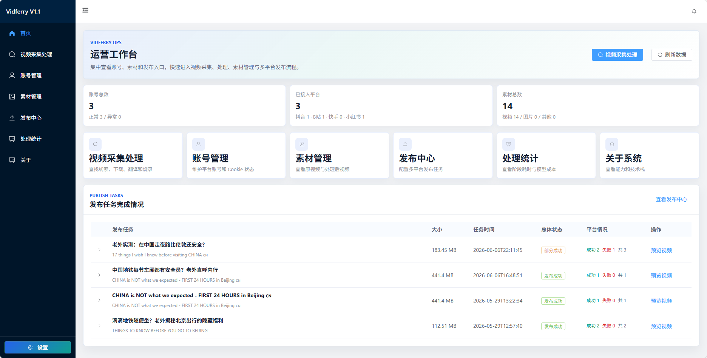
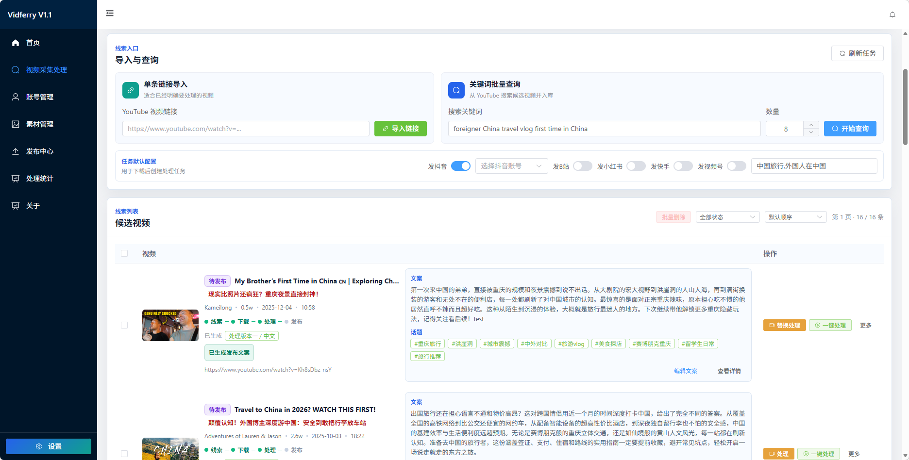
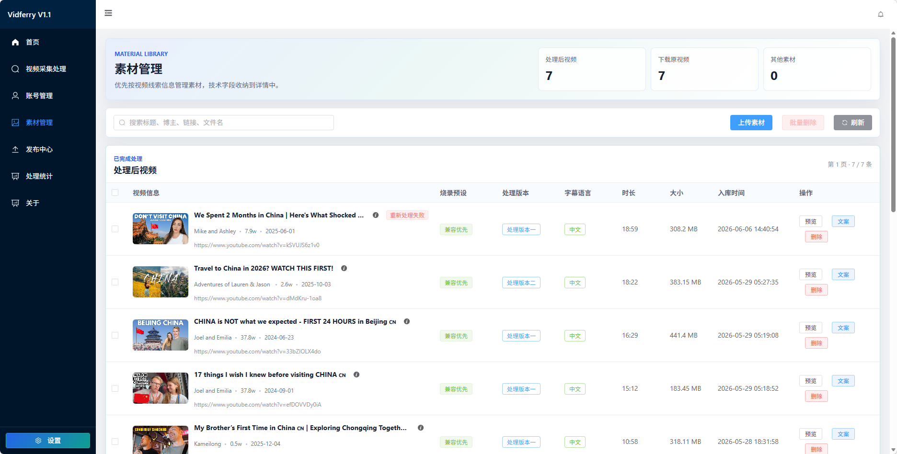
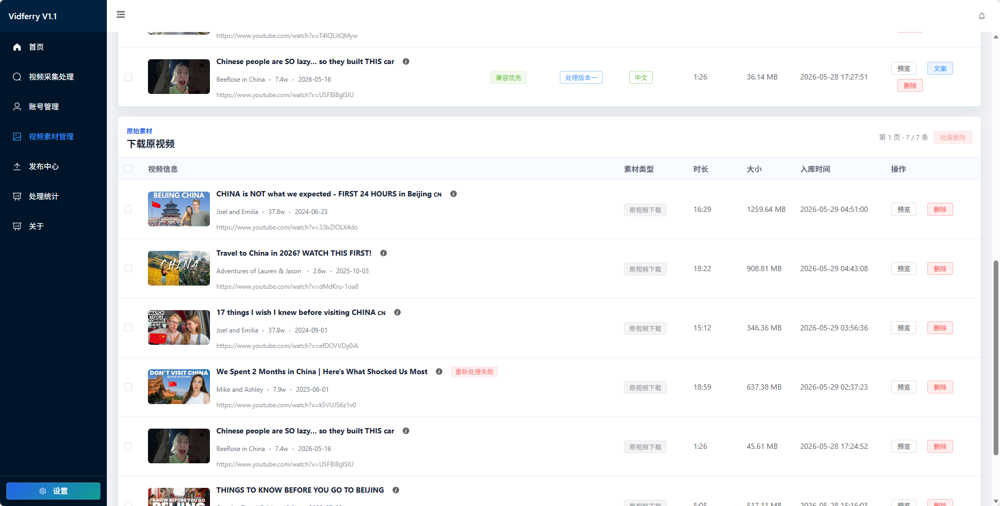
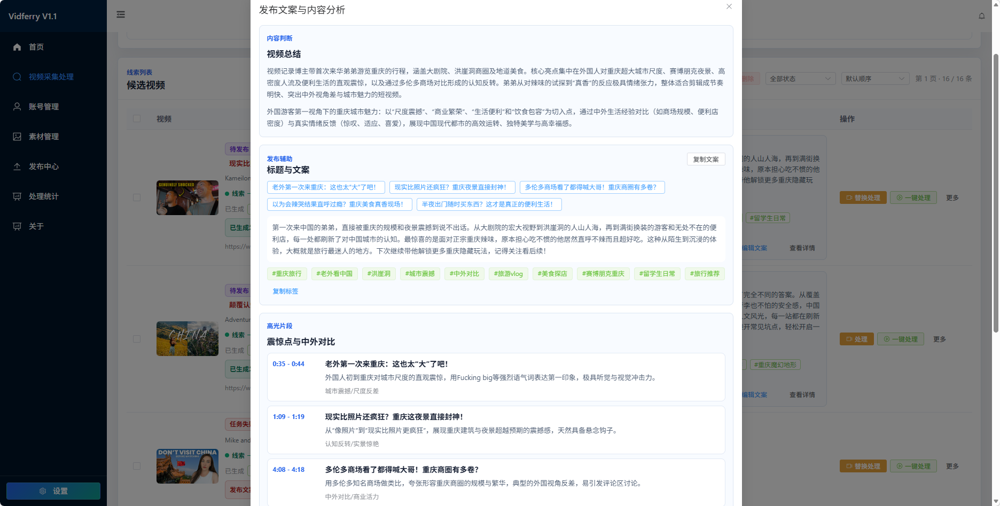
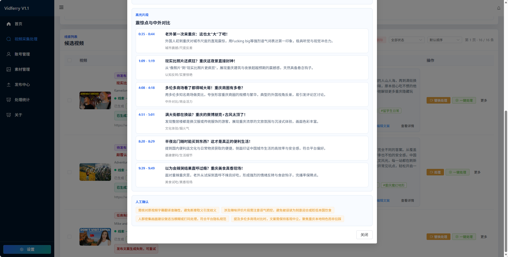
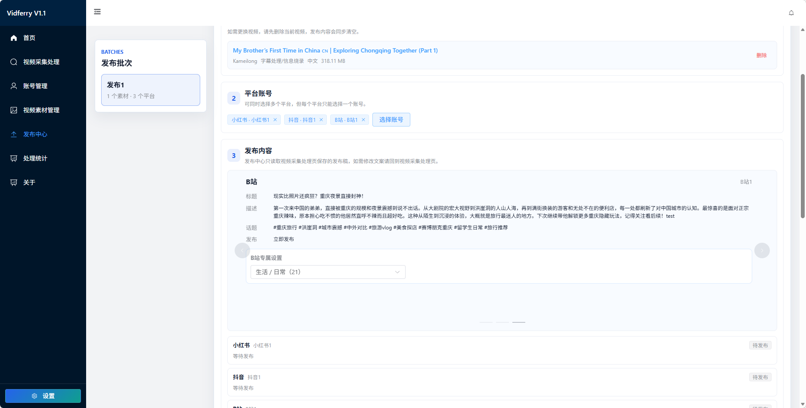
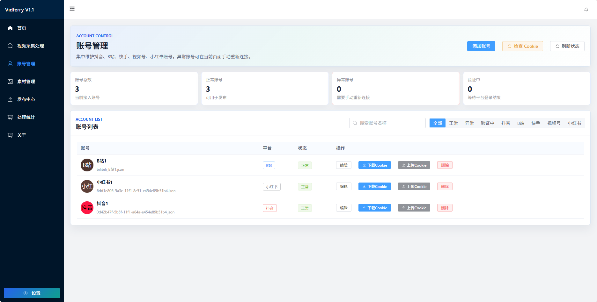
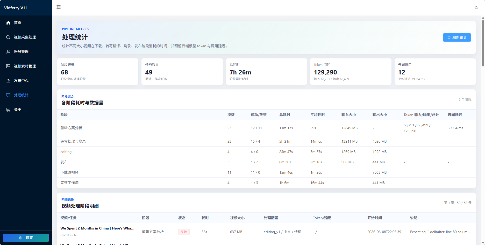

# Vidferry

Vidferry 是一个本地优先的视频采集、处理、视频素材管理和多平台发布工作流。它把 YouTube 视频线索查询、视频下载、ASR 转写、字幕翻译、FFmpeg 字幕烧录、LLM 发布文案生成、视频素材管理和发布准备串成一条完整流程。

当前版本仍处于本地开发和个人工作流验证阶段，不建议直接作为生产 SaaS 使用。平台登录、发布和 YouTube 下载能力都依赖本机环境以及第三方平台规则，可能需要持续维护。

## 界面预览

<p align="center">
  
  <br>
  <strong>首页工作台</strong>
</p>

<details>
  <summary>查看全部界面截图</summary>

  <p align="center">
    
    <br>
    <strong>视频链接导入与查询</strong>
  </p>

  <p align="center">
    
    <br>
    <strong>视频素材管理列表</strong>
  </p>

  <p align="center">
    
    <br>
    <strong>视频素材详情与预览</strong>
  </p>

  <p align="center">
    
    <br>
    <strong>发布文案生成</strong>
  </p>

  <p align="center">
    
    <br>
    <strong>发布文案编辑</strong>
  </p>

  <p align="center">
    
    <br>
    <strong>发布中心</strong>
  </p>

  <p align="center">
    
    <br>
    <strong>账号管理</strong>
  </p>

  <p align="center">
    
    <br>
    <strong>处理统计</strong>
  </p>

</details>

## 功能概览

- 视频采集处理：关键词批量查询 YouTube、单链接导入、线索状态筛选、下载和处理任务追踪。
- 视频下载：基于 `yt-dlp` 下载视频，并写入本地素材库。
- 字幕处理：基于 `faster-whisper` 转写，生成目标语言字幕，并默认保留英文字幕。
- 视频烧录：基于 FFmpeg 输出国内平台更兼容的 MP4，并在左上角烧录原作者信息。
- 内容分析：基于 OpenAI-compatible LLM 生成标题候选、作品描述、话题标签、视频总结和高光片段建议。
- 视频素材管理：区分下载原视频和处理后视频，支持预览、删除和状态同步。
- 发布中心：选择处理后视频，自动带入发布稿，并按平台账号提交发布任务。
- 账号管理：维护抖音、B站、快手、视频号、小红书账号 Cookie 状态。

## 技术栈

- 后端：Python 3.10-3.12、Flask、SQLite
- 前端：Vue 3、Vite、Element Plus、Pinia
- 下载：yt-dlp
- 转写：faster-whisper / CTranslate2
- 视频处理：FFmpeg
- 浏览器自动化：patchright / Chrome
- B站发布：biliup
- 内容分析：OpenAI-compatible Chat Completions API

## 系统要求

推荐环境：

- Windows 10/11
- Python `>=3.10,<3.13`
- Node.js `>=18`
- Git
- Google Chrome
- FFmpeg
- Conda，推荐用于后端 Python 环境

必须能在终端执行：

```powershell
conda --version
python --version
node --version
npm --version
git --version
ffmpeg -version
```

如果 `ffmpeg -version` 不可用，需要先安装 FFmpeg 并加入 PATH，或在 `conf.py` 中配置 `FFMPEG_COMMAND`。

## 快速部署

以下命令以 Windows PowerShell 为例。

### 1. 克隆项目

```powershell
git clone https://github.com/Thendras-1024/Vidferry.git
cd Vidferry
```


### 2. 创建后端虚拟环境

推荐使用 Conda 创建名为 `vidferry` 的后端环境：

```powershell
conda create -n vidferry python=3.12 -y
conda activate vidferry
python -m pip install -U pip
pip install -r requirements.txt
pip install -e .
```

说明：

- 后端运行、CLI、视频下载/处理、平台自动化发布都需要在 `vidferry` 环境中执行。
- `pip install -r requirements.txt` 用于安装当前开发环境快照中的依赖。
- `pip install -e .` 用于把项目本身以开发模式安装，并注册 `sau` 命令。
- 当前 `requirements.txt` 推荐环境是 Windows + Conda + Python 3.12；它不是严格跨平台锁文件，可能包含历史依赖，也包含 `pywin32`、`pywinpty` 等 Windows 相关依赖。
- Linux/macOS 安装失败时，优先改用 `pip install -e ".[web]"`，或按平台调整不兼容依赖。

可选：如果只想按项目声明的 Web 最小依赖安装，可以使用：

```powershell
pip install -e ".[web]"
```

可选：如果仍想使用 uv，也可以执行：

```powershell
python -m pip install uv
uv sync --extra web
```

### 3. 安装浏览器自动化依赖

项目使用 `patchright` 驱动浏览器。国内网络可使用镜像：

```powershell
conda activate vidferry
$env:PLAYWRIGHT_DOWNLOAD_HOST="https://npmmirror.com/mirrors/playwright"
patchright install chromium
```

如果你已经安装了本机 Chrome，也建议在 `conf.py` 中配置 `LOCAL_CHROME_PATH`，扫码登录和发布流程通常更稳定。

### 4. 配置后端文件

复制配置文件：

```powershell
Copy-Item conf.example.py conf.py
Copy-Item .env.example .env
```

建议至少检查 `conf.py`：

```python
LOCAL_CHROME_PATH = "C:/Program Files/Google/Chrome/Application/chrome.exe"
LOCAL_CHROME_HEADLESS = False
FFMPEG_COMMAND = "ffmpeg"
YOUTUBE_DOWNLOAD_DIR = BASE_DIR.parent / "video"
YOUTUBE_PROCESSED_DIR = BASE_DIR / "videos" / "processed"
```

`.env` 推荐配置：

```env
YOUTUBE_DOWNLOAD_DIR=./videos/youtube
YOUTUBE_PROCESSED_DIR=./videos/processed
YOUTUBE_TRANSCRIPT_DIR=./videos/transcripts

# 可选：YouTube 需要 JS challenge 时使用
# YTDLP_JS_RUNTIME=node
# YTDLP_JS_RUNTIME_PATH=C:/Program Files/nodejs/node.exe
# YTDLP_REMOTE_COMPONENTS=ejs:github

# 可选：内容分析和发布文案生成
# LLM_BASE_URL=https://dashscope.aliyuncs.com/compatible-mode/v1
# LLM_API_KEY=sk-your-key
# LLM_MODEL=qwen-plus
# LLM_TIMEOUT=90
# LLM_MAX_TRANSCRIPT_CHARS=28000

# 可选：Whisper 转写模型下载和缓存
# HF_HOME=./models/huggingface
# HF_ENDPOINT=https://hf-mirror.com
# WHISPER_MODEL_SIZE=small
# WHISPER_DEVICE=cpu
# WHISPER_COMPUTE_TYPE=int8
```

说明：

- `.env` 用于本地路径、LLM 和 yt-dlp 运行参数。
- `conf.py` 用于本机 Chrome、FFmpeg、默认下载目录等本地配置。
- 两者都属于本地配置，不要提交到 Git。

### 5. 安装前端依赖

前端不需要激活 `vidferry` Conda 环境，只需要本机 Node.js/npm 可用：

```powershell
cd sau_frontend
npm install
cd ..
```

### 6. 启动后端

在项目根目录打开第一个终端：

```powershell
conda activate vidferry
python run.py
```

默认后端地址：

```text
http://127.0.0.1:5409
```

如果要修改监听地址或端口，在 `.env` 中配置：

```env
VIDFERRY_HOST=0.0.0.0
VIDFERRY_PORT=5409
```

### 7. 启动前端

打开第二个终端。这个终端不需要激活 Conda 环境：

```powershell
cd sau_frontend
npm run dev
```

默认前端地址：

```text
http://127.0.0.1:5173
```

Vite 已配置代理：前端请求 `/api` 会转发到 `http://127.0.0.1:5409`。

## 首次使用流程

### 1. 打开 Web 控制台

访问：

```text
http://127.0.0.1:5173
```

### 2. 配置账号

进入“账号管理”，添加需要发布的平台账号。

平台说明：

- 抖音、小红书、快手、视频号：通常会打开浏览器或展示二维码，按页面提示扫码登录。
- B站：使用 biliup 能力，首次运行可能自动准备运行时文件。

Cookie 文件会保存到：

```text
cookiesFile/
```

这些文件包含账号登录信息，不要提交、分享或上传到公开环境。

### 3. 查询或导入视频

进入“视频采集处理”：

- 使用关键词批量查询 YouTube 候选视频。
- 或粘贴单个 YouTube 链接导入。

### 4. 下载视频

在线索列表中点击下载。下载完成后，原视频会进入“视频素材管理”的下载原视频区域。

如果 YouTube 提示需要 JS runtime，可安装 Node.js 或 Deno，并在 `.env` 中配置 `YTDLP_JS_RUNTIME`。

### 5. 处理视频

点击“处理”或“一键处理”后，系统会执行：

```text
读取原视频 -> 提取音频 -> Whisper 转写 -> 翻译字幕 -> 生成 ASS -> FFmpeg 烧录 -> 处理后素材入库
```

处理版本：

- 处理版本一：基础字幕处理和左上角原作者信息。
- 处理版本二：在基础处理上叠加高光片段分析和剪辑增强，仍在迭代中。

### 6. 生成和编辑发布稿

LLM 配置完成后，系统可以生成：

- 标题候选
- 作品描述
- 话题标签
- 视频总结
- 高光片段建议

LLM 原始结果只读保存。用户最终发布使用的标题、文案、话题会作为发布稿单独保存。

### 7. 发布中心发布

进入“发布中心”：

1. 选择一个处理后视频。
2. 选择一个或多个平台账号，每个平台最多一个账号。
3. 检查发布内容。
4. 按平台设置专属字段，例如：
   - 抖音：商品名称、商品链接
   - B站：投稿分区
5. 提交发布。

已成功发布过的平台会被限制重复发布，避免同一个视频重复发到同一平台。

## 目录说明

```text
app/                 后端 API、核心业务、数据库、任务和工具模块
sau_backend.py       兼容入口，负责加载模块化后端
run.py               后端正式启动入口
sau_frontend/        Vue 3 + Vite 前端
uploader/            各平台上传适配器
myUtils/             账号、登录和历史工具函数
utils/               通用工具
videos/              下载、转写、处理输出目录
videoFile/           素材库文件目录
db/                  本地 SQLite 数据库
cookiesFile/         平台账号 Cookie 文件
docs/                安装、CLI 和历史设计文档
```

## 关键配置说明

### FFmpeg

默认使用 PATH 中的 `ffmpeg`：

```python
FFMPEG_COMMAND = "ffmpeg"
```

如果 FFmpeg 没有加入 PATH，可以写绝对路径：

```python
FFMPEG_COMMAND = "D:/tools/ffmpeg/bin/ffmpeg.exe"
```

### Chrome

建议配置本机 Chrome：

```python
LOCAL_CHROME_PATH = "C:/Program Files/Google/Chrome/Application/chrome.exe"
LOCAL_CHROME_HEADLESS = False
```

`LOCAL_CHROME_HEADLESS = False` 会显示浏览器窗口，适合扫码登录和排查发布流程。

### LLM

内容分析使用 OpenAI-compatible API。DashScope 示例：

```env
LLM_BASE_URL=https://dashscope.aliyuncs.com/compatible-mode/v1
LLM_API_KEY=sk-your-dashscope-key
LLM_MODEL=qwen-plus
LLM_TIMEOUT=90
LLM_MAX_TRANSCRIPT_CHARS=28000
```

不配置 LLM 时，下载、字幕处理和视频素材管理仍可使用，但内容总结和发布文案生成不可用或会失败。

### YouTube 下载

yt-dlp 会随 Python 依赖安装。某些 YouTube 页面可能需要 JS runtime：

```env
YTDLP_JS_RUNTIME=node
YTDLP_JS_RUNTIME_PATH=C:/Program Files/nodejs/node.exe
```

或使用 Deno：

```env
YTDLP_JS_RUNTIME=deno
YTDLP_JS_RUNTIME_PATH=C:/Users/you/.deno/bin/deno.exe
```

## 第三方依赖下载与安装说明

### biliup

B站登录、检查和上传能力基于 `biliup`。用户通常不需要手动安装 `biliup`：

- 首次运行 `sau bilibili ...` 或 Web 端 B站相关能力时，程序会自动检查并准备 `biliup` 运行时。
- 如果本地没有可用的 `biliup`，程序会从 GitHub Release 下载适配当前系统的版本。
- 如果自动下载失败，通常是网络无法访问 GitHub Release，可检查代理/VPN，或参考 [docs/install.md](docs/install.md) 中的 Bilibili 运行时说明。

### yt-dlp

YouTube 查询、导入和下载依赖 `yt-dlp`。它会随 Python 依赖安装：

```powershell
conda activate vidferry
pip install -r requirements.txt
pip install -e .
```

如果只安装项目声明的最小 Web 依赖，也可以使用：

```powershell
pip install -e ".[web]"
```

如果 YouTube 查询或下载异常，可单独更新：

```powershell
conda activate vidferry
python -m pip install -U yt-dlp
```

### FFmpeg

FFmpeg 是本机命令行工具，不会随 Python 依赖自动安装。它用于音视频合并、提取音频、字幕烧录、转码和剪辑拼接。

安装后需要满足：

```powershell
ffmpeg -version
```

如果没有加入 PATH，可以在 `conf.py` 中配置绝对路径：

```python
FFMPEG_COMMAND = "D:/tools/ffmpeg/bin/ffmpeg.exe"
```

### faster-whisper / CTranslate2

语音转写依赖 `faster-whisper`，底层推理依赖 `CTranslate2`。它们会安装到 Conda 的 `vidferry` 环境中；Whisper 模型文件不随 Python 包一起安装，默认在首次转写时自动下载。

本项目当前默认模型是 `small`，对应代码会读取 `WHISPER_MODEL_SIZE`，默认值见 `app/core/subtitle_service.py`。如果没有指定缓存目录，模型通常会进入当前用户的 Hugging Face 缓存目录，例如 Windows 下的 `C:\Users\<用户名>\.cache\huggingface\hub`。如果不想占用 C 盘，建议在 `.env` 中指定：

```env
HF_HOME=./models/huggingface
WHISPER_MODEL_SIZE=small
WHISPER_DEVICE=cpu
WHISPER_COMPUTE_TYPE=int8
```

常见模型体积大致如下，实际占用会随模型版本略有变化：

| 模型 | 适用场景 | 下载体积 |
| --- | --- | --- |
| `tiny` | 最快，质量最低，适合测试安装 | 约 80 MB |
| `base` | 比 `tiny` 稍准，仍很快 | 约 150 MB |
| `small` | 当前默认，速度和质量比较均衡 | 约 500 MB |
| `medium` | 更准，但 CPU 会明显变慢 | 约 1.5 GB |
| `large-v3` | 质量更高，资源占用大 | 约 3.1 GB |

国内网络如果无法直接访问 Hugging Face，可以使用 HF-Mirror 预下载模型。以当前默认 `small` 为例：

```powershell
conda activate vidferry
python -m pip install -U huggingface_hub
$env:HF_ENDPOINT="https://hf-mirror.com"
huggingface-cli download Systran/faster-whisper-small --local-dir models/faster-whisper-small
```

然后在 `.env` 中指定本地模型目录：

```env
WHISPER_MODEL_SIZE=./models/faster-whisper-small
WHISPER_DEVICE=cpu
WHISPER_COMPUTE_TYPE=int8
```

如果只是想让首次运行自动走国内镜像，而不是提前下载，也可以在 `.env` 中配置：

```env
HF_ENDPOINT=https://hf-mirror.com
HF_HOME=./models/huggingface
WHISPER_MODEL_SIZE=small
```

CPU 可以运行 `tiny`、`base`、`small`，但长视频会比较慢；普通电脑优先用 `small` 或 `base`，显卡和内存充足时再考虑 `medium` 或 `large-v3`。

### deep-translator

字幕翻译依赖 `deep-translator`，会随 Python 依赖安装。它不需要额外下载二进制文件，但翻译效果和稳定性会受网络、目标翻译服务可用性影响。

### social-auto-upload

本项目参考并复用了 `social-auto-upload` 的多平台自动化发布思路和部分能力。当前 Vidferry 代码已在本仓库内维护，不需要额外再下载另一个 `social-auto-upload` 仓库。

## CLI 使用

安装后可以使用 `sau` 命令：

```powershell
conda activate vidferry
sau --help
sau douyin --help
sau xiaohongshu --help
sau kuaishou --help
sau bilibili --help
```

示例：

```powershell
conda activate vidferry
sau douyin login --account creator
sau douyin check --account creator
sau douyin upload-video --account creator --file videos/demo.mp4 --title "示例标题" --desc "示例简介"
```

B站示例：

```powershell
conda activate vidferry
sau bilibili login --account creator
sau bilibili check --account creator
sau bilibili upload-video --account creator --file videos/demo.mp4 --title "示例标题" --desc "示例简介" --tid 21
```

更多 CLI 说明见 [docs/CLI.md](docs/CLI.md)。

## 常见问题

### 后端启动失败：缺少 flask_cors

说明 Web 依赖没有安装完整。先激活后端环境，再补装 Web 依赖：

```powershell
conda activate vidferry
pip install -e ".[web]"
```

### 前端能打开，但接口请求失败

检查后端是否运行在：

```text
http://127.0.0.1:5409
```

再检查 `sau_frontend/vite.config.js` 中 `/api` 代理是否仍指向该端口。

### FFmpeg 相关错误

先确认：

```powershell
ffmpeg -version
```

如果不可用，请安装 FFmpeg 或在 `conf.py` 中配置 `FFMPEG_COMMAND` 的绝对路径。

### YouTube 查询或下载失败

常见原因：

- 网络无法访问 YouTube。
- yt-dlp 版本过旧。
- YouTube 页面需要 JS runtime。
- 视频本身不可下载或受地区、年龄、版权限制。

可尝试：

```powershell
conda activate vidferry
python -m pip install -U yt-dlp
```

并配置 Node.js 或 Deno。

### Whisper 很慢

默认可在 CPU 上运行，但长视频会比较慢。可以通过环境变量调整：

```env
WHISPER_MODEL_SIZE=small
WHISPER_DEVICE=cpu
WHISPER_COMPUTE_TYPE=int8
```

如果本机有兼容 GPU，可自行配置 faster-whisper 支持的设备和 compute type。

### 平台登录或发布失败

平台页面和规则变化会影响自动化发布。建议：

- 保持 `LOCAL_CHROME_HEADLESS=False`，方便观察浏览器。
- 先在账号管理里刷新或重新连接账号。
- 确认 Cookie 文件存在于 `cookiesFile/`。
- 发布过程中不要手动关闭自动化浏览器窗口。

## 本地数据与安全

以下内容属于本地运行数据，不应提交到 Git：

```text
.env
conf.py
cookiesFile/
db/*.db
qrcode.png
videos/
videoFile/
sau_frontend/dist/
sau_frontend/node_modules/
```

安全提醒：

- Cookie 文件等同于账号登录凭证。
- LLM API Key 不要写入前端代码或提交记录。
- 发布、删除、下载接口都应只在可信本地环境使用。
- 当前版本没有多用户权限系统，不建议暴露到公网。

## 开发验证

后端语法检查：

```powershell
conda activate vidferry
python -m py_compile sau_backend.py
```

前端构建：

```powershell
cd sau_frontend
npm run build
```

启动顺序建议：

1. 启动后端：`conda activate vidferry` 后执行 `python run.py`
2. 启动前端：`cd sau_frontend && npm run dev`
3. 修改后端配置或 Python 代码后，通常需要重启后端。
4. 修改前端后，Vite 通常会热更新。

## 项目状态

- 当前定位：本地优先、单机工作流、开发验证。
- 当前重点：稳定视频采集、下载、字幕处理、内容分析、视频素材管理和发布准备链路。
- 后续方向：更完整的剪辑版本二、封面帧、云端 OSS、多用户权限、任务队列和更严格的平台发布状态管理。

## 致谢

Vidferry 基于并参考了以下开源项目和工具：

- yt-dlp
- social-auto-upload
- FFmpeg
- faster-whisper / CTranslate2
- deep-translator
- patchright / Playwright
- biliup

## License

MIT License

## 异常报错排查

- `Remote end closed connection without response`：通常是请求被 LLM API 远端服务器识别为非法或异常请求。先检查 VPN/代理是否异常；如果仍然出现，尝试关闭 VPN 后重试。
