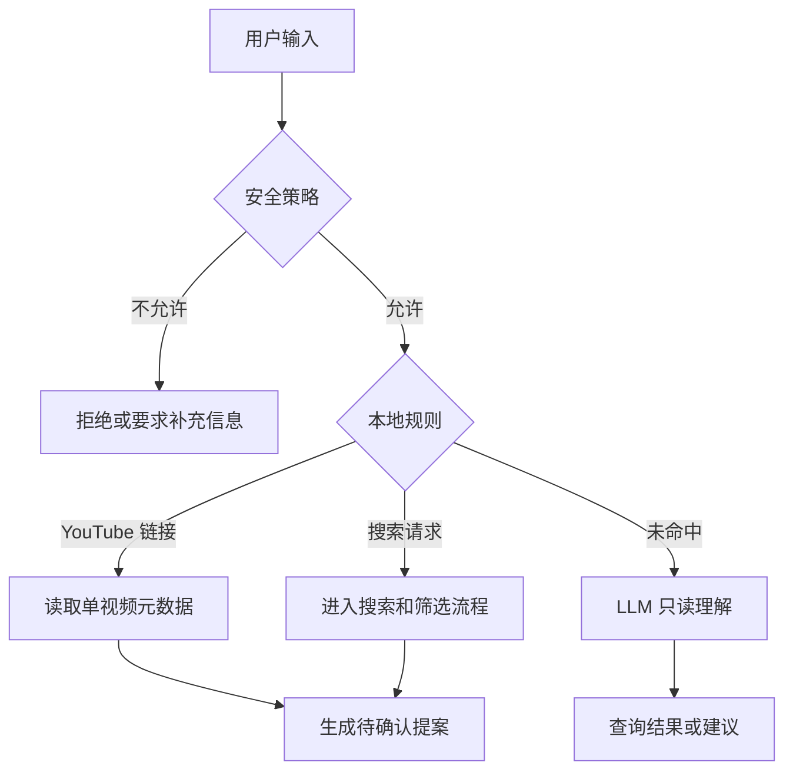
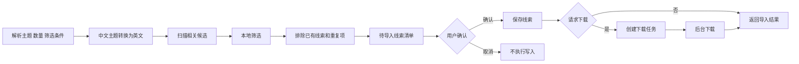

# Vidferry Agent 自然语言处理流程

本文档说明当前 Vidferry Agent 对自然语言输入的实际处理逻辑，包括
YouTube 搜索、线索导入与确认后的下载。

## 当前能力边界

当前 Agent 可以：

- 查询项目状态、视频和账号信息。
- 按关键词检索 YouTube 候选视频。
- 读取单条 YouTube 视频链接的元数据。
- 生成待确认的线索导入清单。
- 在用户确认后导入线索，并为明确要求下载的视频创建下载任务。

当前 Agent 不会自动开始处理、发布、创建定时发布任务、删除记录、登录账号或修改配置。

## 总体路由



### 搜索、确认与下载



每条对话按以下顺序执行：

1. 创建或恢复 Agent 会话，并保存用户消息。
2. 安全策略拦截空输入、敏感信息、提示词注入和不允许的操作。
3. 使用轻量规则优先识别 YouTube 链接和搜索请求。
4. 已识别的单条链接直接读取元数据。
5. 已识别的搜索请求解析关键词、数量和筛选条件。
6. 规则没有命中时，才进入通用的 LLM 只读工具循环。

已识别的 YouTube 搜索和链接请求会使用确定性的规则路径，不再交给通用 LLM 回答器重新解释，避免模型错误拒绝已授权的导入和下载操作。

## 单条链接导入和下载

示例：

```text
下载 https://www.youtube.com/watch?v=Ap0huJwyT7g 这个视频
```

处理步骤：

1. 从输入中提取 YouTube URL。
2. 使用只读工具获取单视频元数据。
3. 生成一条待导入线索。
4. 因为输入包含“下载”，将提案标记为“导入并下载”。
5. 界面显示“确认导入并下载”按钮。
6. 用户确认后才写入线索库并创建下载任务。

链接中存在 `list` 等播放列表参数时，仍按单视频读取，不会自动导入整个播放列表。

## 关键词搜索

示例：

```text
找两个关于 China technology innovation 的视频并且下载
```

本地规则会解析为：

```json
{
  "query": "China technology innovation",
  "limit": 2,
  "requestedAction": "download"
}
```

支持中文数量词，例如“一个”“两个”“三条”，也支持阿拉伯数字，例如“10 个视频”和 `10 videos`。

## 英文检索词转换

主题中包含中文时，若已配置文本 LLM，Agent 会先请求一个简短的英文 YouTube 检索词，再调用 yt-dlp。

- 用户原始关键词仍会保存在线索提案和线索记录中。
- 翻译失败或 LLM 不可用时，回退使用原始关键词，不阻断搜索。
- 时间、播放量和时长等筛选条件会从主题中移除，不会污染英文检索词。

## 支持的筛选条件

| 用户表达 | 结构化条件 |
| --- | --- |
| 近一周 | 发布时间不早于当前日期减 7 天 |
| 近一个月 | 发布时间不早于当前日期减 30 天 |
| 近三个月 | 发布时间不早于当前日期减 90 天 |
| 播放量大于 5000 | `minViews = 5000` |
| 播放量大于三万 | `minViews = 30000` |
| 时长不超过 10 分钟 | `maxDurationSeconds = 600` |

示例：

```text
找一个关于 dog 的视频，播放量大于三万，近一周发布的
```

将解析为：主题为 `dog`，最多一条，播放量至少 30000，发布时间在近一周内。

## 候选收集与过滤

yt-dlp 首先返回一批相关候选：

- 至少扫描 20 条相关候选。
- 有复杂筛选时，最多扫描 50 条相关候选。
- 50 指原始候选扫描量，不代表 50 条都符合筛选条件。

随后后端按以下顺序过滤：

1. 发布时间。
2. 最低或最高播放量。
3. 最短或最长时长。
4. 已存在于 `youtube_videos` 线索库中的视频 ID。
5. 候选之间重复的视频 ID、链接，或相同标题加频道。
6. 用户要求的最终数量。

缺少某个已启用筛选所需元数据的候选不会通过该筛选。例如没有发布时间的候选不能满足“近一周”。

若所有符合条件的视频都已存在于线索列表，Agent 会说明已过滤已有线索，而不是再次展示重复视频。

## 导入确认

后端会创建一个有效期为 15 分钟的内存提案，包含：

- 随机提案 ID。
- 当前 Agent 会话 ID。
- 原始查询、目标分组和候选元数据。
- 可选动作，目前仅支持 `download`。
- 到期时间。

前端逐条展示候选视频并提供勾选框。视频 ID 仅作为内部选中值，不会显示在候选卡片中。

确认时，后端会校验提案归属、会话和有效期；提案确认后立即失效，不能再次使用。

## 确认后的下载

当提案动作为 `download` 时：

1. 保存用户选中的候选线索。
2. 已存在的线索记为重复，不再创建新记录。
3. 对尚未下载的视频创建仅下载的工作流任务。
4. 将下载任务提交给后台工作线程。

响应会返回新建线索数、重复数、失败数和新建下载任务数。不会自动创建处理或发布任务。

## 相关代码

- `app/core/agent_orchestrator.py`：路由、参数解析、提案和确认下载。
- `app/core/agent_tools.py`：搜索工具和本地筛选。
- `app/core/youtube_search_service.py`：yt-dlp 元数据提取，包括播放量。
- `app/core/agent_policy.py`：安全策略。
- `app/api/agent.py`：对话和确认接口。
- `sau_frontend/src/App.vue`：Agent 抽屉、候选勾选和确认界面。
