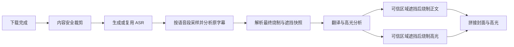

# 原视频字幕自动识别与适配方案

## 状态与目标

本文是原视频字幕自动识别与遮挡的唯一设计基线。此前首版采用全片均匀视觉抽帧、两帧一致即可采纳、识别失败时使用大范围兜底遮挡的方案，现已被本方案替代；现有实现尚未完成本方案中的 ASR 关联验证与完整动态横向定位。

系统在视频下载完成后、字幕翻译与高光渲染前，先复用一次 ASR 转写结果，再分析原视频字幕。目标是仅识别承担对白字幕作用的文字，决定是否保留原字幕、烧制新字幕，以及是否遮挡原字幕；遮挡区域按视频动态适配，避免不必要的大范围马赛克。

首版优化仍不做逐帧字幕跟踪。正文和全部高光片段共用同一个每视频稳定遮挡区域，封面片头不遮挡。识别结果仅保存到任务快照，不写入视频主表，也不跨任务缓存。

## 字幕模式与决策

| 模式 | 分析 | 最终行为 |
| --- | --- | --- |
| `auto` | 先完成或复用 ASR，再执行关联视觉分析 | 按分类与证据决定 |
| `force_burn` | 仅在“遮挡原字幕”开启时分析 | 始终烧制；只有区域可信时才遮挡 |
| `original` | 否 | 不遮挡、不烧制 |
| `legacy` | 否 | 历史任务继续使用已保存的两个布尔字段 |

自动模式状态机：

| 分类或结果 | 遮挡 | 烧制 | 界面结果 |
| --- | --- | --- | --- |
| `zh` | 否 | 否 | 原字幕（中文或中英双语） |
| `none` | 否 | 是 | 烧制 |
| `non_zh` 且区域可信 | 是，使用稳定动态区域 | 是 | 遮挡后烧制 |
| `non_zh` 但区域不可信 | 否 | 是 | 烧制，不遮挡 |
| `unknown` | 否 | 是 | 识别不确定，烧制但不遮挡 |

中文与外语双语字幕归为 `zh`。`unknown` 包括 ASR 不可用、模型不可用、超时、契约错误、证据矛盾、置信度不足和无法建立语音关联等情况。任何识别异常都不能阻断视频处理，也不得触发大范围兜底马赛克。

## 采样与双证据判定

### ASR 引导采样

自动模式统一先生成或复用现有 ASR 转写，避免为后续字幕烧制重复转写。仅从有语音的时间段分层抽取视频帧，并为每帧附带时间点、关联 ASR 片段及必要的相邻上下文。抽帧用于收集候选证据，不保证任一帧必然包含字幕。

### 字幕证据要求

多模态模型同时查看图片和对应 ASR 文本。一个候选文字只有同时满足下列要求时才可计为对白字幕证据：

- 位于画面下方区域，字幕框中心不得高于画面高度的 60%。
- 跨至少 3 帧，且覆盖至少 2 个独立的有语音 ASR 片段；文字内容应随对白变化，而非固定显示。
- 与同时间段 ASR 存在转写或翻译关系；允许语言不同，不要求逐字相同。
- 不是标题、水印、招牌、弹幕、界面文字、作者剪辑信息、人物身份条或其他非对白画面文字。

模型输出只允许 JSON，建议契约如下：

```json
{
  "classification": "non_zh",
  "confidence": 0.93,
  "evidenceFrames": [
    {
      "frameIndex": 3,
      "timestampSeconds": 24.6,
      "asrSegmentIndexes": [4],
      "language": "non_zh",
      "bbox": { "x": 0.18, "y": 0.82, "width": 0.64, "height": 0.09 },
      "asrRelation": "translation"
    }
  ],
  "rejectedEvidence": [
    { "frameIndex": 6, "reason": "bottom_watermark" }
  ],
  "reason": "英文字幕在多个语音片段中随对白变化，并与 ASR 语义对应"
}
```

`classification` 只能是 `zh/non_zh/none`，`confidence` 必须在 0 到 1 之间，坐标使用 0 到 1 的归一化值。`none` 的证据帧使用 `language=none` 且 `bbox=null`。仅当置信度不低于 `0.75`、至少 3 帧语言与分类一致、覆盖至少 2 个 ASR 片段且都具备有效 `asrRelation` 时，才接受分类和区域。其余情况保存拒绝原因并按 `unknown` 处理。

## 稳定遮挡区域

只对通过双证据验证的字幕框生成遮挡区域。对其 `x/y/right/bottom` 分别使用稳健分位范围汇总，剔除位置离群框后，左右各增加画面宽度 `2%`、上下各增加画面高度 `1%`，得到一个每视频稳定矩形。

区域换算到最终输出尺寸后，`x/y/width/height` 全部向下对齐到偶数、裁剪在画面范围内，并保留最小可用尺寸。横向和纵向位置均来自可信字幕框，不再固定为居中 `88%` 宽，也不强制延伸到画面底部。区域位置波动超出允许范围、无法覆盖足够证据或落入非底部区域时，视为不可信，不执行遮挡。

这不是按时段或逐帧跟随：一条视频只使用一个稳定区域，正文与高光共用该区域。

## FFmpeg 顺序

正文和高光共用同一滤镜构造能力：

```text
输出缩放
  -> 裁剪稳定字幕区域
  -> 按输出短边比例强模糊
  -> 降采样 / 最近邻放大形成约 5-6px 细格
  -> 100% 覆盖回原位置
  -> ASS 字幕 / 评论 / 水印 / Up Next
```

只有可信区域才进入遮挡滤镜。遮挡区域不使用 alpha 回混，也不叠加纯色或黑色蒙层；处理后保留原画面的颜色与运动，但不保留可辨认字形。新字幕始终位于遮挡层上方，封面片头不走遮挡滤镜。

## 任务快照与可追溯性

任务既有 `source_subtitle_analysis` JSON 继续保存识别结果。优化后至少包含：

- `status/classification/confidence/reason/decision`：最终分类与处理决策。
- `evidenceFrames`：含时间点、ASR 片段引用、语言、字幕框和语音关联类型的可信证据。
- `rejectedEvidence`：被排除的候选画面文字及原因。
- `region`：最终稳定遮挡区域；不可信或不需要遮挡时为 `null`。
- `maskDecisionReason`：执行或跳过遮挡的明确原因。

`translation_enabled` 与 `subtitle_mask_enabled` 是检测完成后的最终执行快照。正文签名和片头签名必须包含字幕模式、检测快照和最终布尔值，任一值变化都不能复用旧产物。

日志记录采用稳定、可检索的纯文本格式，例如：

```text
source subtitle analysis completed : job_id = %s | classification = %s | mask_enabled = %s
```

日志不得记录帧图片、ASR 全文或敏感配置。

## 人工覆盖与失败策略

自动模式判断错误时，用户重新创建任务并选择：

- `force_burn`：始终生成新字幕；可开启原字幕遮挡，但仅在可信区域存在时生效。
- `original`：完全保留原视频字幕，不进行分析和烧制。

自定义字幕命令与 `auto`、字幕遮挡不兼容。前端禁用不可用选项，后端仍必须拒绝非法组合。

## 任务阶段



## 验收标准

- 文档和实现均不得把抽帧描述为必然命中字幕；判定基于采样到的多帧证据。
- 只有同时满足底部位置、跨语音片段持续、文本变化和 ASR 关联的文字才会触发遮挡。
- 顶部标题、底部水印、短暂提示、无语音文字和与 ASR 无关文字不会触发遮挡。
- `zh/non_zh/none/unknown` 与三种人工模式的决策符合状态表。
- 可信 `non_zh` 字幕使用每视频稳定动态区域，横纵坐标均可适配；正文与高光均先遮挡后叠加 ASS。
- 区域不可信、模型不可用、ASR 不可用或结果不合法时任务继续烧制新字幕，但不遮挡原画面。
- 遮挡后原字幕字形不可辨认，没有黑条；新字幕和 `Up Next` 完整可读。

## 后续扩展

后续可在稳定区域方案验证后增加 OCR 交叉验证、人工框校正、视频级缓存和按时段遮挡轨迹。逐帧跟踪会增加滤镜复杂度和回归风险，不属于本方案范围。
