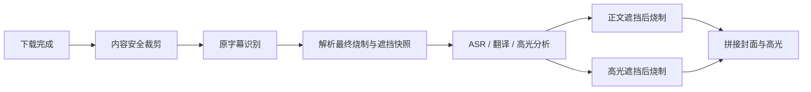

# 原视频字幕自动识别与适配方案

## 目标与边界

系统在视频下载完成后、字幕翻译与高光渲染前，对原视频执行一次字幕分析。分析只判断承担对白字幕作用、位置稳定并随时间变化的文字；招牌、水印、弹幕、标题、界面文字和偶然出现的中文不属于原字幕。

首版不做实时字幕跟踪。正文和全部高光片段使用同一个固定遮挡区域，封面片头不遮挡。识别结果仅保存到任务快照，不写入视频主表，也不跨任务缓存。

## 字幕模式

| 模式 | 模型识别 | 最终行为 |
| --- | --- | --- |
| `auto` | 是 | 按识别分类自动决定 |
| `force_burn` | 仅在“遮挡原字幕”开启时 | 始终烧制；有原字幕或识别失败时遮挡 |
| `original` | 否 | 不遮挡、不烧制 |
| `legacy` | 否 | 历史任务继续使用已保存的两个布尔字段 |

自动模式状态机：

| 分类 | 遮挡 | 烧制 | 界面结果 |
| --- | --- | --- | --- |
| `zh` | 否 | 否 | 原字幕（中文） |
| `none` | 否 | 是 | 烧制 |
| `non_zh` | 是，使用识别区域 | 是 | 遮挡后烧制 |
| `unknown` | 是，使用兜底区域 | 是 | 识别失败，遮挡后烧制 |

中文与外语双语字幕归为 `zh`。`unknown` 包括模型不可用、超时、契约错误、证据矛盾、置信度不足等情况，任何识别异常都不能阻断视频处理。

## 采样与模型契约

从视频 `5%-95%` 时段均匀抽取最多 12 帧，每帧缩放到 960px 宽。多模态模型只返回 JSON：

```json
{
  "classification": "non_zh",
  "confidence": 0.93,
  "evidenceFrames": [
    {
      "frameIndex": 3,
      "language": "non_zh",
      "bbox": { "x": 0.18, "y": 0.82, "width": 0.64, "height": 0.09 }
    },
    {
      "frameIndex": 8,
      "language": "non_zh",
      "bbox": { "x": 0.16, "y": 0.81, "width": 0.68, "height": 0.10 }
    }
  ],
  "reason": "多帧底部出现随对白变化的英文字幕"
}
```

`classification` 只能是 `zh/non_zh/none`，`confidence` 必须在 0 到 1 之间。字幕框使用 0 到 1 的归一化坐标；`none` 的证据帧使用 `language=none` 且 `bbox=null`。至少两帧语言与分类一致且置信度不低于 `0.75` 才接受分类，否则转为 `unknown`。

## 遮挡区域

识别成功时，对有效字幕框取并集，左右各增加画面宽度 `2%`，上下各增加画面高度 `1%`。区域换算到最终输出尺寸后，`x/y/width/height` 全部向下对齐到偶数，并裁剪在画面范围内。

识别失败时使用固定兜底区域：水平居中、宽 `84%`、高 `14%`、距底 `2%`。该区域适配横屏、竖屏、1080p 和 2K 输出。

## FFmpeg 顺序

正文和高光共用同一滤镜构造能力：

```text
输出缩放
  -> 裁剪字幕区域
  -> 按输出短边比例强模糊
  -> 降采样 / 最近邻放大形成约 5-6px 细格
  -> 100% 覆盖回原位置
  -> ASS 字幕 / 评论 / 水印 / Up Next
```

遮挡区域不再使用 alpha 回混，也不叠加纯色或黑色蒙层。处理后区域保留原画面的颜色与运动，但不保留可辨认字形。封面片头不走遮挡滤镜。

## 数据结构

任务表新增：

- `subtitle_mode`: `auto | force_burn | original | legacy`
- `source_subtitle_analysis`: JSON 文本，保存 `status/classification/confidence/evidenceFrames/region/reason/decision`

`translation_enabled` 与 `subtitle_mask_enabled` 是检测完成后的最终执行快照。正文签名和片头签名必须包含字幕模式、检测快照和最终布尔值，任一值变化都不能复用旧产物。

## 人工覆盖与失败策略

自动模式判断错误时，用户重新创建任务并选择：

- `强制烧制`：始终生成现有双行字幕；可选择遮挡原字幕。
- `原字幕`：完全保留原视频字幕，不进行检测和烧制。

自定义字幕命令与 `auto`、字幕遮挡不兼容。前端禁用不可用选项，后端仍必须拒绝非法组合。

## 任务阶段



## 验收标准

- `zh/non_zh/none/unknown` 与三种人工模式的决策符合状态表。
- 原字幕字形不可辨认，没有黑条，马赛克格约 5-6px。
- 识别框完整覆盖全视频出现过的最长字幕，兜底框为 `84% × 14%`。
- 正文与高光均先遮挡后叠加 ASS；新字幕和 `Up Next` 完整可读。
- 中文原字幕模式不产生遮挡滤镜，不烧制新字幕。
- 模型不可用或结果不合法时任务继续执行，并保存 `unknown` 原因。

## 后续扩展

可在任务级识别稳定后增加字幕时序跟踪、OCR 辅助验证、可视化框校正和视频级缓存。首版不引入这些状态与失效规则。
